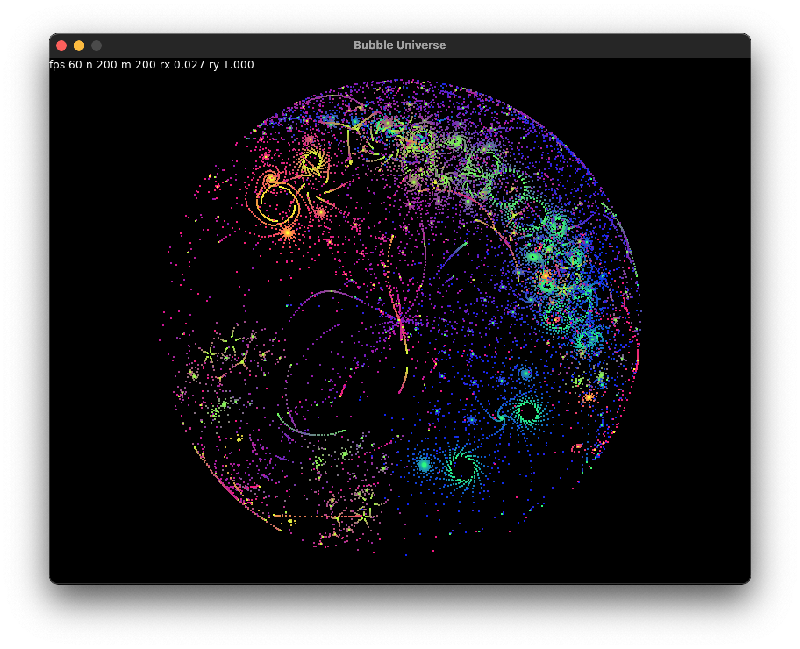
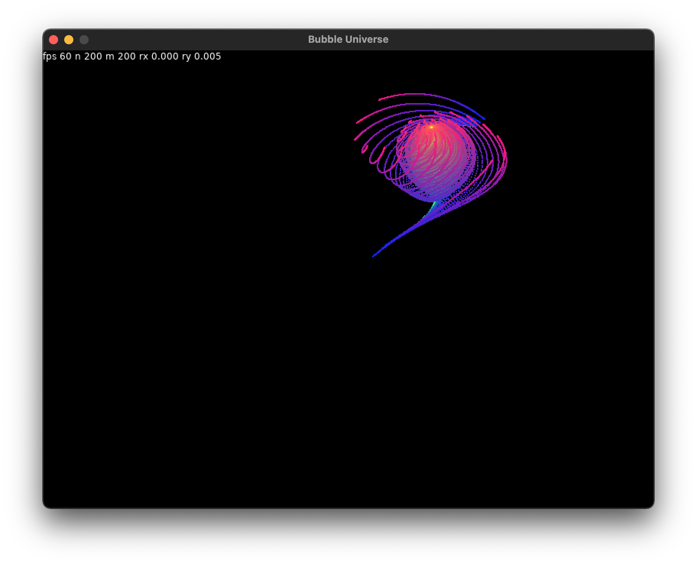
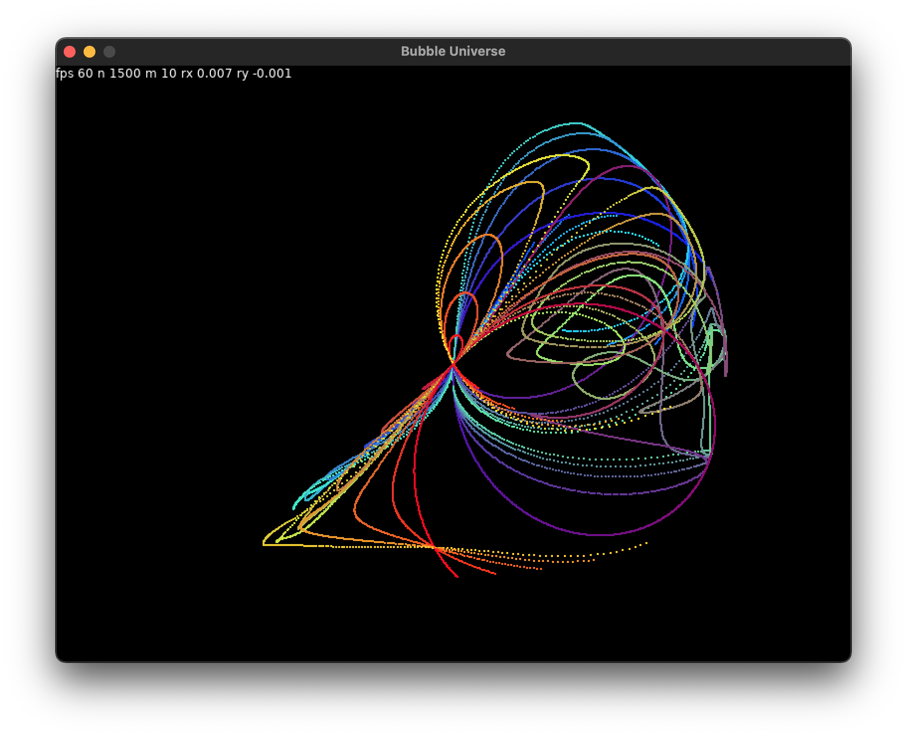
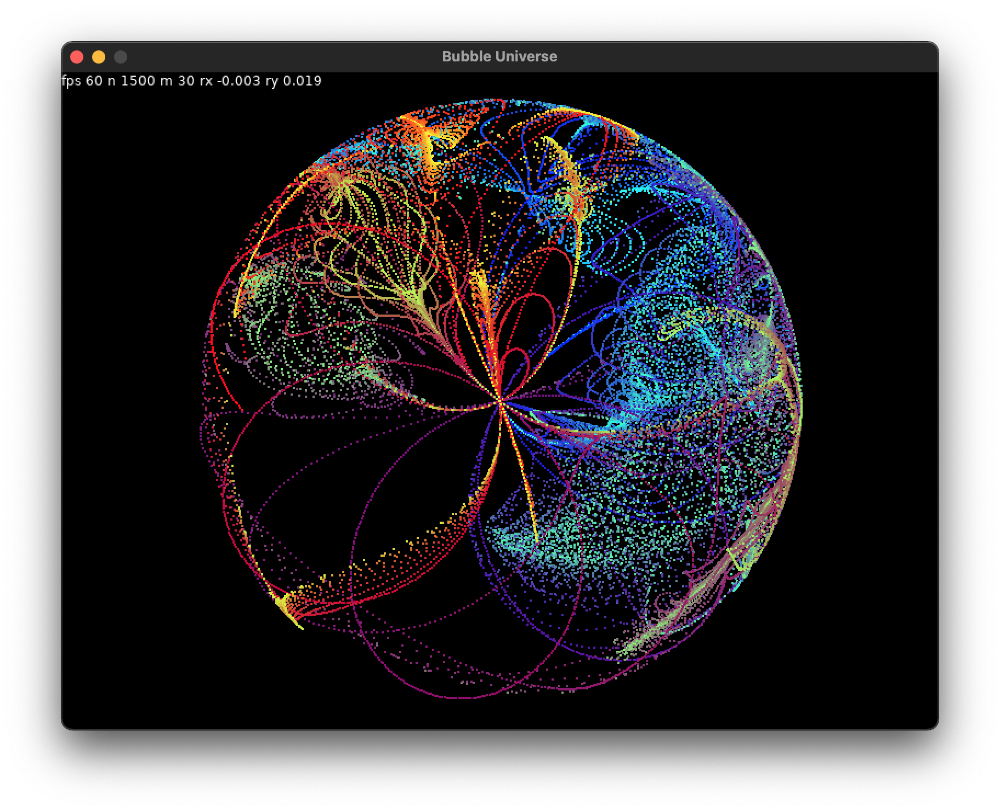
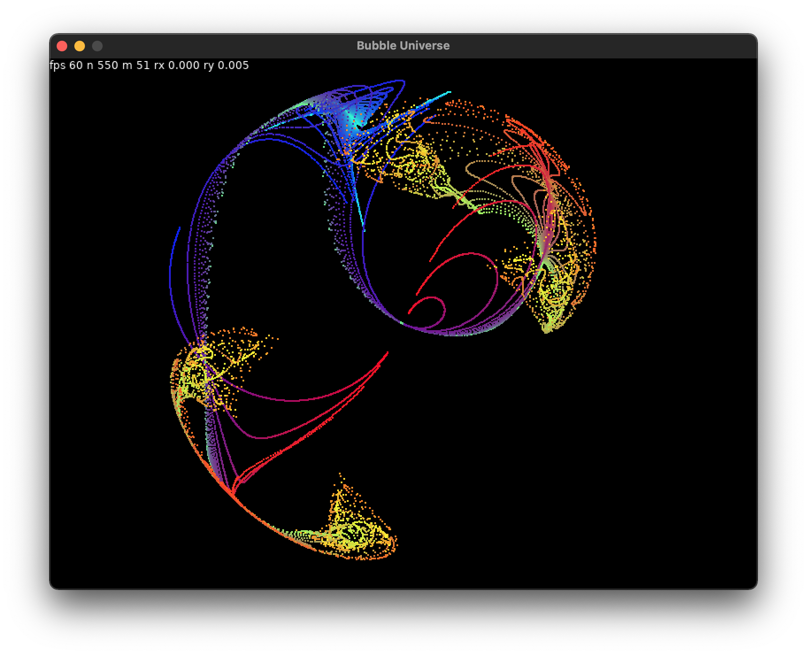

# Bubble Universe

Implementation of Bubble Universe in [Lua](https://www.lua.org) and [LÖVE](https://www.love2d.org).

See [this StarDot thread](https://www.stardot.org.uk/forums/viewtopic.php?t=25833) for context.

To run on macOS:

1. Install [LÖVE](https://www.love2d.org) in `/Applications`.
2. In a terminal, navigate to this repository, with the `main.lua` file.
3. From there, issue `open /Applications/love.app --args $PWD`.

Interaction:

- `escape` exits.
- `1` and `2` change the number of objects `n` by one. Keep `shift` pressed for steps of 50.
- `3` and `4` do the same for the number of particles per object `m`.
- `space` resets everything to the default universe.
- `a` changes to an interesting figure.
- Click the mouse in the figure to set the starting angles `rx` and `ry` between -2π and +2π.

In the top-left corner the current frame rate is shown, as well as the current values of `n`, `m`, `rx` and `ry`.

Some images:

